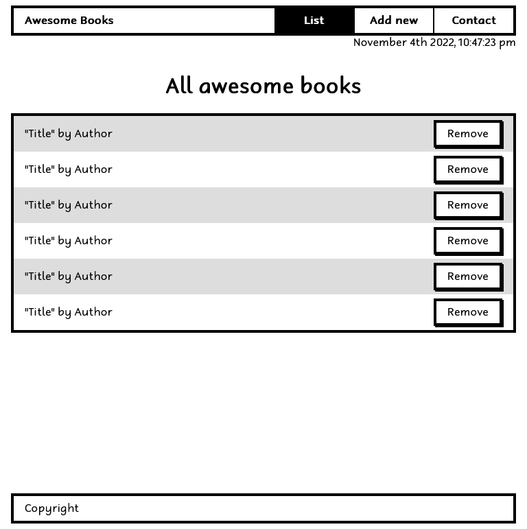
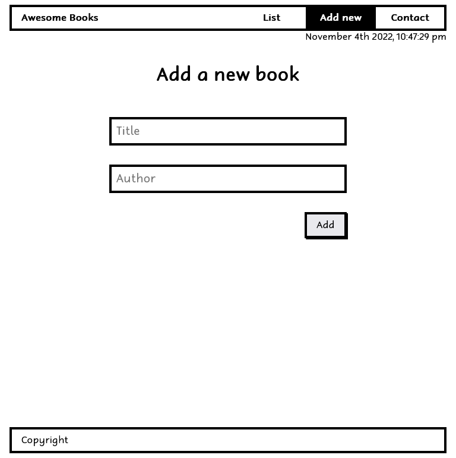
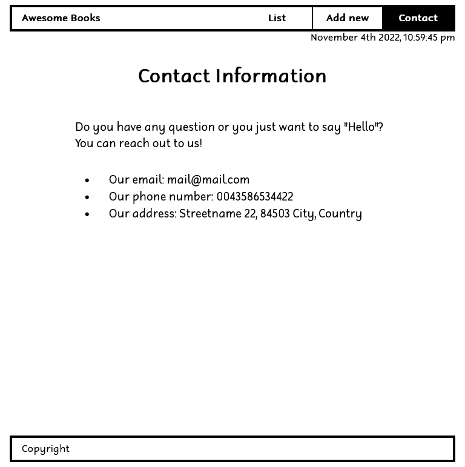

# Awesome books: with ES6

## 📗 Table of Contents

- [📖 Overview](#about-project)
  - [Project Objectives](#project-objectives)
  - [🛠 Built With](#built-with)
    - [Tech Stack](#tech-stack)
    - [Key Features](#key-features)
  - [🚀 Live Demo](#live-demo)
    - [Screenshots](#screenshots)
- [💻 Getting Started](#getting-started)
  - [Setup](#setup)
  - [Prerequisites](#prerequisites)
  - [Install](#install)
  - [Run tests](#run-tests)
  - [Deployment](#deployment)
- [👥 Authors](#authors)
- [🔭 Future Features](#future-features)
- [🤝 Contributing](#contributing)
- [⭐️ Show your support](#support)
- [🙏 Acknowledgements](#acknowledgements)
- [📝 License](#license)

## 📖 Overview 

In this project, we built a basic website that allows users to add/remove books from a list. This was achieved by using JavaScript objects and arrays while using javascript DOM and basic events to dynamically modify the page.

### Project Objectives 

- [x] Re-create the [Awesome books app](https://github.com/yosaddis/Awesome-books) following the rules:
  - [x] Use ES6 syntax.
  - [x] Divide code into modules. the following modules were created:
    - [x] *BookList.js:* for BookList class
    - [x] *datetime.js:* for the time function
    - [x] luxon: the downloaded luxon library
- [x] Display the current date below the navigation bar.
  - [x]  For this requirement we use a library [Luxon](https://moment.github.io/luxon/#/install?id=es6)

__See the article [Get the current date and time](https://moment.github.io/luxon/#/tour?id=get-the-current-date-and-time).__

## Built With

- [HTML](https://developer.mozilla.org/en-US/docs/Web/HTML)
- [JavaScript](https://developer.mozilla.org/en-US/docs/Web/JavaScript)
- [CSS](https://developer.mozilla.org/en-US/docs/Web/CSS)
- [Luxon](https://moment.github.io/luxon/#/install?id=es6)
- [ES6](https://www.w3schools.com/js/js_es6.asp)

### Key Features 

- [x] Preserving data with localStorage
- [x] Using ES6 syntax
- [x] Using modules

## 🚀 Live Demo 

> [Live Demo Link](https://fmanimashaun.github.io/Awesome-book_es6)

### Screenshots 

<h3 align="center">Screenhot</h3>

  
  
  

## 💻 Getting Started 

- [Optional] Install git bash to your machine to enable you to clone this repo.
- install Visual Studio to be able to host a local live version.
- Install a browser to view the local live version.

To get a local copy up and running follow these simple example steps.

### Setup 

- Open your GitHub account the repository's [link](https://github.com/fmanimashaun/Awesome-book_es6)

### Prerequisites 

- Internet connection
- A github account

### Install 

- copy the repo's link and clone it by writing `git clone https://github.com/fmanimashaun/AAwesome-book_es6.git` on your git bash terminal.
- `npm install` to install the dependencies

### Run tests 

- You can check for errors by running linter tests found in the github flows.

### Deployment 

- Click on 'go live' on your visual studio to view the project live on your local machine.

## Authors 

👤 **Engr. Animashaun Fisayo**

- [GitHub](https://github.com/fmanimashaun)
- [Twitter](https://twitter.com/fmanimashaun)
- [LinkedIn](https://www.linkedin.com/in/fmanimashaun/)
- [Website](https://fmanimashaun.com)

# 🤝 Contributing 

Contributions, issues, and feature requests are welcome!

Feel free to check the [issues page](../../issues/).

## ⭐️ Show your suppor 

Give a ⭐️ if you like this project!

## 📝 License 

This project is [MIT](./LICENSE) licensed.
